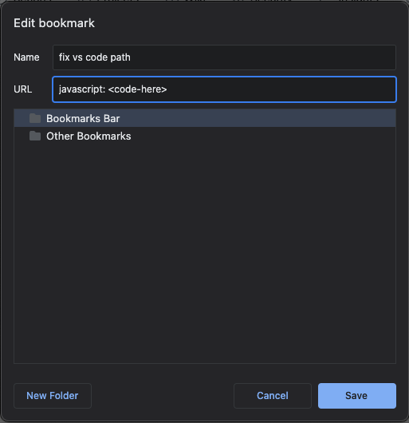

# Local VS Code Links

    

- Make a bookmark `CMD + D (Mac)`
- You might wanna adust path for core folder
- Paste the code at index.js into url as screenshot above
- Click on this bookmarklet before click links inside 'Super Admin' div. 
